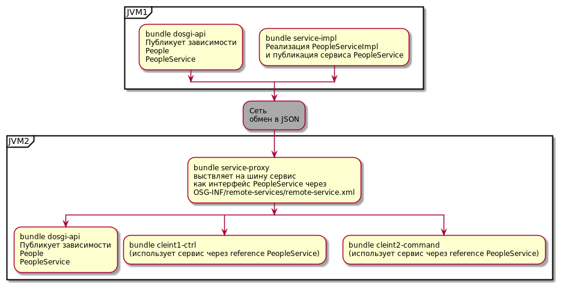

=== Работа с DOSGI в Karaf

==== Схема

==== Компиляция

[source,bash]
----
mvn clean install
----

==== Модули

- *api-simple* - Общие для всех зависимости.
Модель и интерфейс доступа
- *service-simple* - Сервис для доступа извне
- *client-simple* - Клиент

==== Установка

- Установить karaf.
Запустить bin/karaf
- В каталог {karaf-install-catalog}/deploy скопировать setup/feature-blueprint-base.xml
- Создать инстанс _internet_ (например).
В итоге будут запущены 2 java машины

[source,bash]
----
karaf@root()>instance:create internet
----

- В каталог {karaf-install-catalog}/instances/internet/deploy скопировать setup/feature-blueprint-base.xml
- *Установить и запустить zookeeper!!!
Без этого ничего не получится!!!* Нужен для discovery сервиса

[source]
----
karaf@root()>feature:install aries-rsa-discovery-zookeeper-server
karaf@root()>instance:connect internet
karaf@internet()>feature:install aries-rsa-discovery-zookeeper
----

Установить бандлы

[source,bash]
----
# Настройка сервера
cp api/bundles/dosgi-api*.jar {karaf-install-catalog}/deploy/

cp service-impl/bundles/dosgi-service-impl*.jar {karaf-install-catalog}/deploy/

# Настройка клиента
cp api/bundles/dosgi-api*.jar {karaf-install-catalog}/instances/internet/deploy/

cp service-proxy/bundles/dosgi-service-proxy*.jar {karaf-install-catalog}/instances/internet/deploy/

cp client1-ctrl/bundles/dosgi-client1-ctrl*.jar {karaf-install-catalog}/instances/internet/deploy/

cp client2-command/bundles/dosgi-client2*.jar {karaf-install-catalog}/instances/internet/deploy/
----

=== Тестирование

- Проверить статус бандлов.
Выполнять в консоли karaf

[source]
----
karaf@root()>list
391 │ Active   │  80 │ 1.0.8              │ dosgi-service-simple
392 │ Active   │  80 │ 1.0.3              │ dosgi-api-simple

karaf@root()>instance:connect internet
karaf@internet()>list
340 │ Active │  80 │ 1.0.3              │ dosgi-api-simple
342 │ Active │  80 │ 1.0.9              │ dosgi-client-simple
----

==== Проверка сервиса

(Используется утилита httpie.)

[source,bash]
----
bash>http -j http://127.0.0.1:8181/cxf/peoples
HTTP/1.1 200 OK
Content-Type: application/json
Date: Tue, 06 Apr 2021 12:24:01 GMT
Server: Jetty(9.4.31.v20200723)
Transfer-Encoding: chunked

[
    {
        "id": 100,
        "name": "NAME_100"
    },
    {
        "id": 101,
        "name": "nAAA"
    }
]
----

==== Проверка клиента client2-command.

Выполнять в консоли karaf

[source]
----
karaf@root()>instance:connect internet
karaf@internet()>people:list
People{id=100, name='NAME_100'}
----

==== Проверка клиента client1-ctrl

REST-запрос на клиента, ктр. вызывает удаленный DOSGI сервис. *Порт 8182*. (Используется утилита httpie.)

[source]
----
$ http :8182/cxf/client
HTTP/1.1 200 OK
Content-Type: application/json
Date: Tue, 06 Apr 2021 14:44:32 GMT
Server: Jetty(9.4.31.v20200723)
Transfer-Encoding: chunked

[
    {
        "id": 100,
        "name": "NAME_100"
    }
]
----

==== Ссылки
- https://github.com/apache/cxf-dosgi
- http://liquid-reality.de/Karaf-Tutorial/08/
- https://cxf.apache.org/dosgi-ds-demo-page.html

